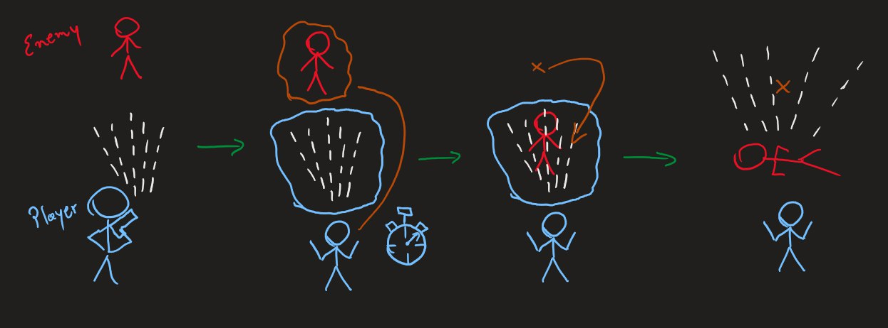

We are Pyramid Scams Games, an indie video game developer formed by 3 friends currently studying at Universidad de Chile, FCFM, within the CS Department (DCC)

# pyramid-scams-games-game

Essentially a combination between a roguelike/bullet hell where you control the movement of bullets and units, like a kind of force.

The original idea for the game came after Nicoaranc played "Star Wars Jedi: Fallen Order," where he shared with the rest of us his idea of stopping bullets. As we discussed it further, the concept described on the game's official page emerged

## First draw of the idea

## Game page
[Pyramid Scams Untitled on itch.io](https://pyramid-scams-games.itch.io/pyramid-scams-untitled) where you can try the latest release of the game

## Developers:
- [TheMilanMiracle](https://github.com/TheMilanMiracle)
- [Dagt](https://github.com/Dagt07)
- [Nicoaranc](https://github.com/nicoaranc)

Game developed by Pyramid Scams Games